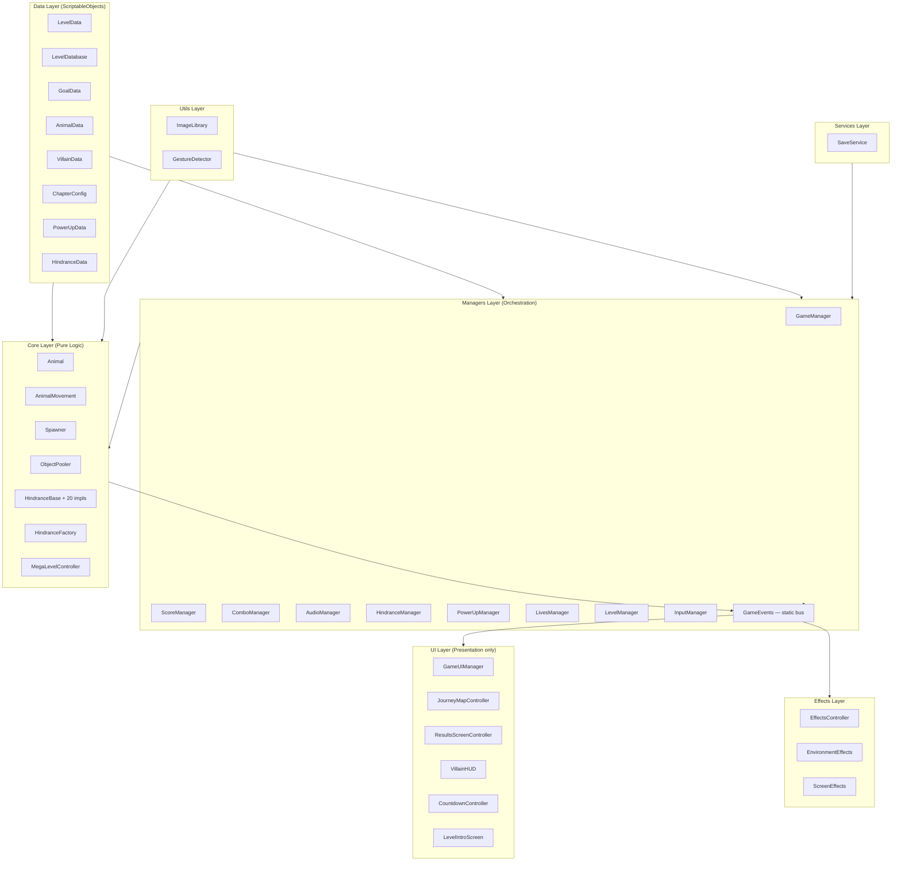
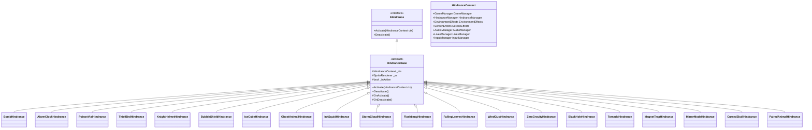
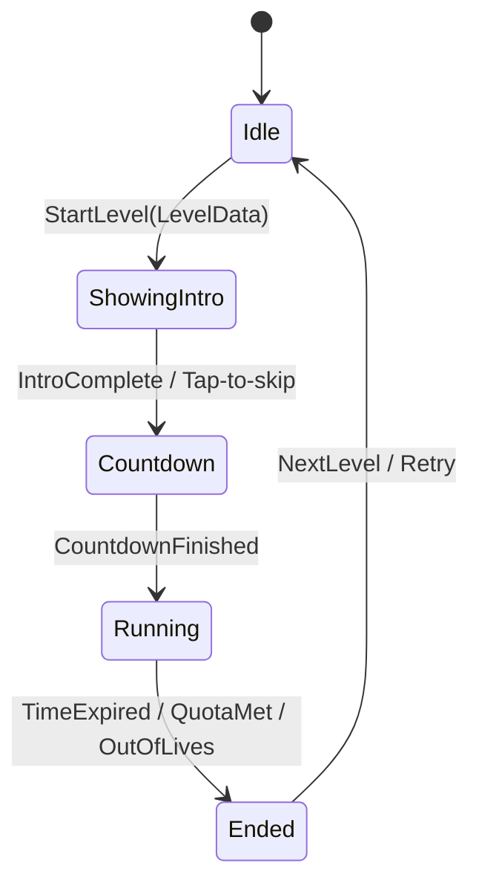

# Design Document — Animal Fall Redesign

## Overview

Animal Fall is a polished 50-level mobile tap-to-save game. Animals fall from the top of the screen; the player taps them before they hit the bottom. Each level runs a countdown timer with a species-based rescue target. As levels progress, hindrances drawn from the Animal Blast library layer in and boss fights appear every 5 levels.

This document is the complete implementation blueprint for the ground-up redesign. Every architecture decision, class contract, data schema, and asset path needed to write the code is here.

### Key Design Decisions

| Decision | Rationale |
|---|---|
| Zero GC during gameplay — ObjectPooler for all runtime objects | Prevent frame-rate stutters on mid-range Android devices |
| DOTween for all animations, no raw coroutines for tweens | Consistent animation API, easy kill-on-return, no dangling coroutines |
| Static `GameEvents` C# Action bus | No hard references from Core → UI; enables scene isolation |
| `LevelManager` is the only `DontDestroyOnLoad` | Prevents stale references between GameScene reloads |
| `ImageLibrary` static sprite cache | Single load per sprite, no repeated `Resources.Load` during gameplay |
| ScriptableObject `LevelData` + `GoalData` | Designer-configurable without code changes |
| `StaticCanvas` + `DynamicCanvas` split | Prevents full Canvas rebuild during fast score/timer updates |


---

## Architecture

### Layer Diagram



### Dependency Rules

- Dependencies flow **downwards**: UI and Effects never import Managers or Core directly — they subscribe to `GameEvents`.
- `Core` classes never import `UI` or `Effects` classes — they fire `GameEvents`.
- `GameManager` orchestrates the loop but does **not** call UI methods directly after Phase 1 setup.
- `ImageLibrary` is the **sole** entry point for sprite retrieval — no `Resources.Load` elsewhere.
- `ObjectPooler` is the **sole** entry point for runtime instantiation — no `Instantiate`/`Destroy` during gameplay.


---

## Scene Hierarchy — GameScene

```
GameScene (root)
├── [Bootstrap]
│   └── AppBootstrap               ← sets targetFrameRate = 60, battery watcher
│
├── [Persistence]
│   └── LevelManager               ← DontDestroyOnLoad (only one in project)
│
├── [Managers]
│   ├── GameManager
│   ├── ScoreManager
│   ├── ComboManager
│   ├── AudioManager               ← 12 pooled AudioSource children
│   ├── HindranceManager
│   ├── PowerUpManager
│   └── LivesManager
│
├── [Core]
│   ├── ObjectPooler
│   ├── Spawner
│   │   └── SpawnPoints (6 Transform children)
│   ├── InputManager
│   └── AnimalContainer            ← parent for all pooled Animal GameObjects
│
├── [Effects]
│   ├── EffectsController
│   ├── EnvironmentEffects
│   └── ScreenEffects
│       ├── InkOverlay             ← pooled fullscreen overlay
│       ├── StormGradient          ← pooled lower-screen gradient
│       ├── FlashbangOverlay       ← pooled fullscreen flash
│       └── BottomEdgeFlash        ← pooled miss-indicator strip
│
├── [UI — StaticCanvas] (sort order 0)
│   ├── TopBar                     ← chapter name, settings button
│   ├── BottomBar                  ← power-up slots
│   └── ChapterBackground          ← bg_chapter<N>.png
│
├── [UI — DynamicCanvas] (sort order 1)
│   ├── GameUIManager
│   ├── TimerDisplay               ← clock icon + text
│   ├── ScoreDisplay
│   ├── ComboDisplay
│   ├── GoalPanel                  ← per-species target row
│   ├── ProgressBar
│   ├── FloatingTextPool           ← pooled score pop-ups
│   ├── VillainHUD                 ← hidden unless MegaLevel
│   ├── LevelIntroOverlay
│   ├── CountdownController
│   ├── ResultsScreenController
│   └── ToastNotification
│
└── [UI — MapCanvas] (separate scene: MapScene)
    └── JourneyMapController
```


---

## Data Layer

All persistent, designer-editable data lives in ScriptableObjects under `Assets/Levels/` or `Assets/Data/`.

### `LevelData` — `Assets/Scripts/Core/Levels/LevelData.cs` [REWRITE]

```csharp
namespace AnimalFall.Data
{
    [CreateAssetMenu(fileName = "Level_XX", menuName = "AnimalFall/Level Data")]
    public class LevelData : ScriptableObject
    {
        [Header("Identity")]
        [Tooltip("1-based level index (1–50).")]
        [SerializeField] private int _levelNumber;
        [Tooltip("Display name of the chapter this level belongs to.")]
        [SerializeField] private string _chapterTheme;
        [Tooltip("Background sprite: bg_chapter<N>.png from AnimalBlast panels/.")]
        [SerializeField] private Sprite _chapterBackground;

        [Header("Timer & Goal")]
        [Tooltip("Countdown duration in seconds (10–120).")]
        [SerializeField, Range(10f, 120f)] private float _timeLimit;
        [Tooltip("Per-species rescue targets. Must be a ScriptableObject asset.")]
        [SerializeField] private GoalData _goal;

        [Header("Spawner")]
        [Tooltip("Animals eligible to spawn this level (1–12 entries).")]
        [SerializeField] private AnimalData[] _spawnPool;
        [Tooltip("Base seconds between spawns (0.1–2.0).")]
        [SerializeField, Range(0.1f, 2.0f)] private float _spawnInterval = 0.6f;
        [Tooltip("± randomness on spawn interval (0–0.5).")]
        [SerializeField, Range(0f, 0.5f)] private float _spawnVariance = 0.15f;
        [Tooltip("Max simultaneous animals on screen (1–20).")]
        [SerializeField, Range(1, 20)] private int _maxOnScreen = 8;

        [Header("Hindrances")]
        [Tooltip("Hindrance entries with type, weight, initial delay.")]
        [SerializeField] private HindranceConfig[] _hindrances;
        [Tooltip("Seconds between hindrance activations (1–30).")]
        [SerializeField, Range(1f, 30f)] private float _hindranceSpawnInterval = 6f;
        [Tooltip("Seconds before first hindrance spawns (2–15).")]
        [SerializeField, Range(2f, 15f)] private float _hindranceInitialDelay = 5f;
        [Tooltip("Max simultaneous active hindrances (1–5).")]
        [SerializeField, Range(1, 5)] private int _maxHindrancesActive = 2;

        [Header("Penalties")]
        [Tooltip("Seconds deducted per wrong tap.")]
        [SerializeField] private float _wrongTapTimePenalty = 1.0f;
        [Tooltip("Score deducted per wrong tap.")]
        [SerializeField] private int _wrongTapScorePenalty = 30;
        [Tooltip("Seconds deducted when a bomb is tapped.")]
        [SerializeField] private float _bombTimePenalty = 3.0f;
        [Tooltip("Score deducted when a bomb is tapped.")]
        [SerializeField] private int _bombScorePenalty = 50;

        [Header("Rewards")]
        [Tooltip("Coins awarded on level win (0–500).")]
        [SerializeField, Range(0, 500)] private int _rewardCoins;

        [Header("Mega Level")]
        [Tooltip("True for every 5th level (L5, L10, … L50).")]
        [SerializeField] private bool _isMegaLevel;
        [Tooltip("Required when isMegaLevel = true.")]
        [SerializeField] private VillainData _villain;

        // Public accessors (read-only properties)
        public int LevelNumber        => _levelNumber;
        public string ChapterTheme    => _chapterTheme;
        public Sprite ChapterBackground => _chapterBackground;
        public float TimeLimit        => _timeLimit;
        public GoalData Goal          => _goal;
        public AnimalData[] SpawnPool => _spawnPool;
        public float SpawnInterval    => _spawnInterval;
        public float SpawnVariance    => _spawnVariance;
        public int MaxOnScreen        => _maxOnScreen;
        public HindranceConfig[] Hindrances => _hindrances;
        public float HindranceSpawnInterval => _hindranceSpawnInterval;
        public float HindranceInitialDelay  => _hindranceInitialDelay;
        public int MaxHindrancesActive      => _maxHindrancesActive;
        public float WrongTapTimePenalty    => _wrongTapTimePenalty;
        public int WrongTapScorePenalty     => _wrongTapScorePenalty;
        public float BombTimePenalty        => _bombTimePenalty;
        public int BombScorePenalty         => _bombScorePenalty;
        public int RewardCoins              => _rewardCoins;
        public bool IsMegaLevel             => _isMegaLevel;
        public VillainData Villain          => _villain;
    }

    [System.Serializable]
    public class HindranceConfig
    {
        [Tooltip("Hindrance type to potentially spawn.")]
        public HindranceType type;
        [Tooltip("Relative spawn weight (> 0). Higher = spawns more frequently.")]
        [Range(0.01f, 10f)] public float weight = 1f;
        [Tooltip("Additional seconds delay before this type can first spawn.")]
        [Range(0f, 30f)] public float initialDelay;
    }
}
```


### `GoalData` — `Assets/Scripts/Core/Goals/GoalData.cs` [NEW]

```csharp
namespace AnimalFall.Data
{
    [CreateAssetMenu(fileName = "Goal_XX", menuName = "AnimalFall/Goal Data")]
    public class GoalData : ScriptableObject
    {
        [System.Serializable]
        public struct SpeciesTarget
        {
            [Tooltip("Target animal species.")]
            public AnimalSpecies species;
            [Tooltip("Number of this species to rescue.")]
            [Range(1, 50)] public int count;
        }

        [Tooltip("Per-species rescue targets. All listed species must appear in the level spawnPool.")]
        [SerializeField] private SpeciesTarget[] _targets;

        public SpeciesTarget[] Targets => _targets;

        public int TotalCount
        {
            get
            {
                int total = 0;
                for (int i = 0; i < _targets.Length; i++) total += _targets[i].count;
                return total;
            }
        }
    }
}
```

### `AnimalData` — `Assets/Scripts/Core/Animals/AnimalData.cs` [KEEP shape, update fields]

```csharp
namespace AnimalFall.Data
{
    [CreateAssetMenu(fileName = "AnimalData", menuName = "AnimalFall/Animal Data")]
    public class AnimalData : ScriptableObject
    {
        [Tooltip("Species enum value — drives sprite lookup via ImageLibrary.")]
        public AnimalSpecies species;
        [Tooltip("Type controls special tap behaviour.")]
        public AnimalType type;
        [Tooltip("Movement pattern for this animal.")]
        public MovementPattern movementPattern;
        [Tooltip("Minimum fall speed (world units/s).")]
        [Range(0.5f, 10f)] public float speedMin = 1.5f;
        [Tooltip("Maximum fall speed (world units/s).")]
        [Range(0.5f, 10f)] public float speedMax = 3f;
        [Tooltip("Point value on correct tap.")]
        public int pointValue = 50;
        [Tooltip("Shield HP for Shielded type; 0 for others.")]
        [Range(0, 5)] public int shieldHP;
        [Tooltip("True if this species counts toward the level goal.")]
        public bool isTargetSpecies;
        [Tooltip("Seconds before the animal auto-returns to pool (lifetime).")]
        [Range(1f, 30f)] public float lifetime = 8f;
        [Tooltip("ZigZag/SineWave amplitude in world units.")]
        public float zigzagAmplitude = 0.5f;
        [Tooltip("ZigZag/SineWave frequency.")]
        public float zigzagFrequency = 2f;
    }
}
```

### `VillainData` — `Assets/Scripts/Core/MegaLevel/VillainData.cs` [NEW]

```csharp
namespace AnimalFall.Data
{
    [CreateAssetMenu(fileName = "VillainData", menuName = "AnimalFall/Villain Data")]
    public class VillainData : ScriptableObject
    {
        [Tooltip("Display name of the villain.")]
        public string villainName;
        [Tooltip("Portrait sprite for VillainHUD.")]
        public Sprite portrait;
        [Tooltip("Number of HP phases (typically 3).")]
        [Range(1, 5)] public int hpPhases = 3;
        [Tooltip("Animals to rescue per phase before dealing 1 HP.")]
        public int[] animalsPerPhase;
        [Tooltip("Projectile spawn frequency per phase (seconds between shots).")]
        public float[] projectileFrequencyPerPhase;
        [Tooltip("Projectile prefab (pooled).")]
        public GameObject projectilePrefab;
    }
}
```

### `ChapterConfig` — `Assets/Scripts/Core/Levels/ChapterConfig.cs` [NEW]

```csharp
namespace AnimalFall.Data
{
    [CreateAssetMenu(fileName = "ChapterConfig", menuName = "AnimalFall/Chapter Config")]
    public class ChapterConfig : ScriptableObject
    {
        [Tooltip("1-based chapter index (1–5).")]
        [Range(1, 5)] public int chapterIndex;
        [Tooltip("Display name (e.g. Sunny Meadow).")]
        public string chapterName;
        [Tooltip("Camera background color hex (e.g. #F5E87A).")]
        public Color backgroundColor;
        [Tooltip("Chapter background panel sprite: bg_chapter<N>.png.")]
        public Sprite backgroundSprite;
        [Tooltip("First level index (1-based, inclusive).")]
        public int firstLevel;
        [Tooltip("Last level index (1-based, inclusive).")]
        public int lastLevel;
        [Tooltip("Focus species for this chapter.")]
        public AnimalSpecies[] focusSpecies;
    }
}
```

### `PowerUpData` — `Assets/Scripts/Core/PowerUps/PowerUpData.cs` [NEW]

```csharp
namespace AnimalFall.Data
{
    public enum PowerUpType { SlowTime, Magnet, MultiTap, AutoTap, FreezeAll }

    [CreateAssetMenu(fileName = "PowerUpData", menuName = "AnimalFall/Power-Up Data")]
    public class PowerUpData : ScriptableObject
    {
        [Tooltip("Power-up type identifier.")]
        public PowerUpType powerUpType;
        [Tooltip("Icon sprite from AnimalBlast icons/boosters/.")]
        public Sprite icon;
        [Tooltip("Cooldown in seconds after activation.")]
        [Range(5f, 120f)] public float cooldown = 30f;
        [Tooltip("Duration of the active effect in seconds.")]
        [Range(1f, 30f)] public float duration = 4f;
        [Tooltip("MultiTap: radius in world units for area collection.")]
        public float radius = 2f;
        [Tooltip("MultiTap: number of taps with area effect.")]
        public int charges = 3;
    }
}
```

### `LevelDatabase` — `Assets/Scripts/Core/Levels/LevelDatabase.cs` [REWRITE]

```csharp
namespace AnimalFall.Data
{
    [CreateAssetMenu(fileName = "LevelDatabase", menuName = "AnimalFall/Level Database")]
    public class LevelDatabase : ScriptableObject
    {
        [Tooltip("Ordered array of all 50 LevelData assets.")]
        [SerializeField] private LevelData[] _levels;

        public int TotalLevels => _levels != null ? _levels.Length : 0;

        public LevelData GetLevel(int zeroBasedIndex)
        {
            if (_levels == null || zeroBasedIndex < 0 || zeroBasedIndex >= _levels.Length)
            {
                Debug.LogError($"[LevelDatabase] Index {zeroBasedIndex} out of range.");
                return null;
            }
            return _levels[zeroBasedIndex];
        }

#if UNITY_EDITOR
        [ContextMenu("Generate & Save 50 Levels")]
        public void GenerateAndSave50Levels() { /* See Level Generation section */ }
#endif
    }
}
```


---

## Core Layer

### Enums — `AnimalEnums.cs` [REWRITE]

```csharp
namespace AnimalFall.Core.Animals
{
    public enum AnimalSpecies
    {
        None, Chicken, Dog, Cow, Cat, Monkey,
        Pig, Rabbit, Penguin, Owl, Mouse, Zebra, Duck   // 12 species total
    }

    public enum AnimalType
    {
        Normal, Decoy, Bomb, Shielded, Golden, Special,
        Paired, Ghost, Bubble, IceCube, Shrinking,
        Rainbow, FakeAnimal, CursedSkull, ThiefBird
    }

    public enum MovementPattern
    {
        Static, Drift, ZigZag, SineWave, Bounce,
        Teleport, FloatUp, HeavyFall, Erratic
    }

    public enum TapResult
    {
        Correct, Wrong, BombExploded, ShieldBroken, Golden, Rainbow,
        FakeCollected, IceCubeFrozen, PairedWaiting,
        CursedSkullDestroyed, GhostMissed, BubblePopped
    }
}
```

### `ObjectPooler` — `Assets/Scripts/Core/ObjectPooler.cs` [NEW — central to everything]

```csharp
namespace AnimalFall.Core
{
    public class ObjectPooler : MonoBehaviour
    {
        public static ObjectPooler Instance { get; private set; }

        // Dictionary<prefab InstanceID, Stack<GameObject>>
        private readonly Dictionary<int, Stack<GameObject>> _pools = new();
        private readonly Dictionary<int, GameObject>        _prefabMap = new();
        private readonly HashSet<int>                        _activeObjects = new();

        void Awake() { Instance = this; }

        // Call during level load only — never during gameplay
        public void CreatePool(GameObject prefab, int initialSize, Transform parent = null)

        // Returns a pooled object; expands pool if empty (logs warning)
        public GameObject SpawnFromPool(GameObject prefab, Vector3 pos, Quaternion rot, Transform parent = null)

        // Returns object to pool; double-return is a no-op + LogWarning
        public void ReturnToPool(GameObject obj)

        // Returns ALL active objects for a given prefab key (called on scene unload)
        public void ReturnAllActive(GameObject prefab)

        // Count of currently active (out-of-pool) objects for a prefab
        public int ActiveCount(GameObject prefab)

        // Called on every ReturnToPool — resets the object state
        private void ResetObject(GameObject obj)
        {
            obj.transform.localScale = Vector3.one;
            var sr = obj.GetComponent<SpriteRenderer>();
            if (sr != null) sr.color = Color.white;
            DOTween.Kill(obj);
            // MonoBehaviour.StopAllCoroutines is called via component scan
            obj.SetActive(false);
        }
    }
}
```

**Double-return guard:** `_activeObjects` is a `HashSet<int>` of `obj.GetInstanceID()`. `SpawnFromPool` adds; `ReturnToPool` checks — if not present, logs warning and returns. This is O(1).

### `Animal` — `Assets/Scripts/Core/Animals/Animal.cs` [REWRITE]

```csharp
namespace AnimalFall.Core.Animals
{
    [RequireComponent(typeof(SpriteRenderer), typeof(Collider2D), typeof(AnimalMovement))]
    public class Animal : MonoBehaviour
    {
        // Public state read by HindranceManager and GameUIManager
        public AnimalData Data         { get; private set; }
        public bool IsCollected        { get; private set; }
        public bool IsPaired           { get; private set; }
        public Animal PairedPartner    { get; private set; }

        // Hindrance state (set by HindranceManager or hindrance classes)
        public int HelmetLayers        { get; set; }   // KnightHelmet
        public bool IsIceFrozen        { get; set; }   // IceCube
        public bool IsBubble           { get; set; }   // BubbleShield
        public float GhostAlpha        { get; set; }   // GhostAnimal
        public float PairedTimer       { get; set; }   // PairedAnimal

        private SpriteRenderer _sr;
        private AnimalMovement _movement;
        private Coroutine _lifetimeCoroutine;
        private bool _isReturned;                       // double-return guard

        void Awake() { /* cache components */ }

        // Called by Spawner.SpawnOne() after ObjectPooler.SpawnFromPool()
        public void SetupForPool(AnimalData data, LevelData level)
        {
            // Stop any running lifetime coroutine first
            if (_lifetimeCoroutine != null) StopCoroutine(_lifetimeCoroutine);
            _isReturned = false;
            IsCollected = false;
            HelmetLayers = 0;
            IsIceFrozen = false;
            IsBubble = false;
            GhostAlpha = 1f;
            Data = data;
            _sr.sprite = ImageLibrary.GetAnimalSprite(data.species);
            _sr.color = Color.white;
            _movement.Configure(data, level);
            _lifetimeCoroutine = StartCoroutine(LifetimeCoroutine(data.lifetime));
        }

        private IEnumerator LifetimeCoroutine(float lifetime)
        {
            yield return _cachedWaits.Get(lifetime);  // pre-allocated WaitForSeconds
            if (!IsCollected) ReturnToPool();
        }

        // Called by InputManager after tap hits this collider
        public TapResult HandleTap()
        {
            if (_isReturned || IsCollected) return TapResult.Wrong;
            // ... full tap logic per AnimalType (see Req 2, 8)
        }

        private void ReturnToPool()
        {
            if (_isReturned) { Debug.LogWarning("[Animal] Double-return prevented."); return; }
            _isReturned = true;
            IsCollected = true;
            if (_lifetimeCoroutine != null) { StopCoroutine(_lifetimeCoroutine); _lifetimeCoroutine = null; }
            DOTween.Kill(gameObject);
            ObjectPooler.Instance.ReturnToPool(gameObject);
        }

        public void OnCollected()
        {
            IsCollected = true;
            // Squash-stretch DOTween, then ReturnToPool after animation
            DOTween.Kill(gameObject);
            transform.DOScale(new Vector3(1.3f, 0.7f, 1f), 0.05f)
                .SetEase(Ease.OutQuad)
                .OnComplete(() =>
                    transform.DOScale(Vector3.one, 0.1f)
                        .SetEase(Ease.OutElastic)
                        .OnComplete(ReturnToPool));
        }
    }
}
```


### `AnimalMovement` — `Assets/Scripts/Core/Animals/AnimalMovement.cs` [REWRITE]

Key fixes over the existing version:
- `RecalcBounds()` called once in `Awake`; only re-called when `Screen.width` or `Screen.height` changes (cached and compared each frame with a **dirty flag** — one int comparison per Update).
- `EnvironmentEffects.Instance` stored in a **local variable** at the top of `Update()` — no repeated `.Instance` access or null-checks inside the same call.
- `Destroy(gameObject)` replaced with `ObjectPooler.Instance.ReturnToPool(gameObject)`.
- `ZeroGravity` check now reads `envEffects.IsZeroGravityActive` from the local variable.
- `BubbleShield` animal floats **upward** when `animal.IsBubble == true`.
- `FreezeAll` power-up disables this component for 3 seconds via `enabled = false`.

```
Configure(AnimalData data, LevelData level)
    — stores MovementPattern, speed range, zigzag params
    — resets spawnTime, startPos, hasBounced, moveDirX
    — does NOT recalculate bounds (Awake already cached them)

Update()
    var envEffects = EnvironmentEffects.Instance;   // ONE local variable
    if (envEffects != null && envEffects.IsZeroGravityActive) { /* float */ return; }
    Vector3 wind   = (envEffects != null && envEffects.IsWindActive)
                      ? new Vector3(envEffects.WindForce.x, envEffects.WindForce.y) * dt
                      : Vector3.zero;
    Vector3 bhPull = ComputeBlackHolePull(envEffects, dt);
    // movement pattern switch
    // apply wind + bhPull
    // clamp X to cached bounds
    // if below screen bottom → ObjectPooler.Instance.ReturnToPool(gameObject)

    // Bounds dirty-flag check (cheap):
    if (_cachedScreenWidth != Screen.width || _cachedScreenHeight != Screen.height)
        RecalcBounds();
```

### `Spawner` — `Assets/Scripts/Core/Animals/Spawner.cs` [REWRITE]

The rewritten Spawner addresses:
- `Instantiate` → `ObjectPooler.Instance.SpawnFromPool`
- LINQ (`Array.Find`, `Array.FindAll`) → pre-allocated fixed-size array with `for` loops
- `RemoveAll(x => x == null)` → unnecessary with pool (pool tracks active count)
- `new WaitForSeconds(…)` inside the loop → one cached instance reused

```
Fields:
    AnimalData[] _cachedPool;          // sized at Setup(), filled from LevelData.SpawnPool
    int          _cachedPoolLen;
    WaitForSeconds _spawnWait;         // allocated once in StartSpawning()
    GameObject   _animalPrefab;        // serialized reference

Setup(LevelData level):
    _level = level;
    _cachedPoolLen = level.SpawnPool.Length;
    if (_cachedPoolLen == 0) { Debug.LogError(...); return; }
    _cachedPool = new AnimalData[_cachedPoolLen];   // only allocation, at load time
    for (int i = 0; i < _cachedPoolLen; i++) _cachedPool[i] = level.SpawnPool[i];

StartSpawning():
    _spawnWait = new WaitForSeconds(level.SpawnInterval);  // ONE allocation
    StartCoroutine(SpawnLoop());

SpawnLoop() IEnumerator:
    while (_spawning)
        if (ObjectPooler.Instance.ActiveCount(_animalPrefab) < _level.MaxOnScreen)
            SpawnOne();
        // Reuse _spawnWait — NO new WaitForSeconds here
        yield return _spawnWait;

SpawnOne():
    AnimalData data = ChooseAnimalData();
    if (data == null) return;
    int spIdx = Random.Range(0, _spawnPoints.Length);
    GameObject obj = ObjectPooler.Instance.SpawnFromPool(
        _animalPrefab, _spawnPoints[spIdx].position, Quaternion.identity, _animalContainer);
    Animal animal = obj.GetComponent<Animal>();
    animal.SetupForPool(data, _level);
    // DOTween entrance: scale (0.1,0.1,1) → (1,1,1) over 0.25s, Ease.OutBack
    obj.transform.localScale = new Vector3(0.1f, 0.1f, 1f);
    obj.transform.DOScale(Vector3.one, 0.25f).SetEase(Ease.OutBack);

ChooseAnimalData():
    // NO LINQ — for loops only on _cachedPool
    // Priority order:  Rainbow (EasterEgg check), Bomb, Shielded, Decoy, Golden, Normal/Special
    // Returns AnimalData or null; logs error if _cachedPool uninitialized
```


### Hindrance System — Class Hierarchy



### `HindranceBase` — `Assets/Scripts/Core/Hindrances/HindranceBase.cs` [REWRITE]

```csharp
namespace AnimalFall.Hindrances
{
    public abstract class HindranceBase : MonoBehaviour, IHindrance
    {
        protected HindranceContext _ctx;
        protected SpriteRenderer _sr;
        protected bool _isActive;

        protected virtual void Awake() { _sr = GetComponent<SpriteRenderer>(); }

        public void Activate(HindranceContext ctx)
        {
            _ctx = ctx;
            _isActive = true;
            OnActivate();
        }

        public void Deactivate()
        {
            if (!_isActive) return;
            _isActive = false;
            OnDeactivate();
            DOTween.Kill(gameObject);
            ObjectPooler.Instance.ReturnToPool(gameObject);   // NOT Destroy()
        }

        protected abstract void OnActivate();
        protected abstract void OnDeactivate();
    }
}
```

### 20 Hindrance Implementations — Activate/Deactivate Logic

#### Category 1: Penalties

**`BombHindrance`** — `Assets/Scripts/Core/Hindrances/Penalties/BombHindrance.cs`
- `OnActivate()`: falls like a normal animal (AnimalMovement-like translate, no pool animal used). SpriteRenderer assigned via `ImageLibrary.GetHindranceSprite(HindranceType.Bomb)`.
- Tapped → `GameEvents.OnBombTapped?.Invoke()` → `GameManager` deducts `bombTimePenalty`; `EffectsController` spawns `Explosion_1_Bam.prefab`; calls `Deactivate()`.
- Reaches bottom without tap → calls `Deactivate()`.

**`AlarmClockHindrance`** — `Assets/Scripts/Core/Hindrances/Penalties/AlarmClockHindrance.cs`
- `OnActivate()`: sets `_ctx.HindranceManager.SpawnIntervalMultiplier = 0.6f`; starts `_alarmCoroutine` for 5 seconds.
- If already active when re-activated: `StopCoroutine(_alarmCoroutine)`, restart — does NOT stack below 0.6x.
- `_alarmCoroutine` OnComplete: `_ctx.HindranceManager.SpawnIntervalMultiplier = 1.0f`; calls `Deactivate()`.
- `OnDeactivate()`: restore multiplier to 1.0f (guard against early Deactivate).

**`PoisonVialHindrance`** — `Assets/Scripts/Core/Hindrances/Penalties/PoisonVialHindrance.cs`
- `OnActivate()`: falls onto screen. Tapped → `_ctx.LivesManager.UseLife()`; `_ctx.AudioManager.PlaySFX(SfxType.WrongTap)`; calls `Deactivate()`.

**`ThiefBirdHindrance`** — `Assets/Scripts/Core/Hindrances/Penalties/ThiefBirdHindrance.cs`
- `OnActivate()`: queries `HindranceManager.GetRandomActiveAnimal()`. If null → `Deactivate()` immediately.
- Else: DOTween-tween the stolen animal's transform.position.x off-screen over 1.5s, `OnComplete` → `ObjectPooler.ReturnToPool(stolenAnimal.gameObject)`; then calls `Deactivate()` on self.

#### Category 2: Tap Modifiers

**`KnightHelmetHindrance`** — `Assets/Scripts/Core/Hindrances/TapModifiers/KnightHelmetHindrance.cs`
- `OnActivate()`: selects a random on-screen animal; sets `animal.HelmetLayers = 3`; attaches helmet overlay sprite via a child SpriteRenderer.
- Each tap decrements `HelmetLayers`; plays DOTween scale bounce `(1.15, 0.85, 1) → (1,1,1)`.
- When `HelmetLayers == 0`: normal collection flow.
- `OnDeactivate()`: removes helmet overlay from animal (if animal still on screen).

**`BubbleShieldHindrance`** — `Assets/Scripts/Core/Hindrances/TapModifiers/BubbleShieldHindrance.cs`
- `OnActivate()`: selects random animal; sets `animal.IsBubble = true`; `AnimalMovement` reads `IsBubble` and applies positive Y velocity (FloatUp variant).
- First tap → `animal.IsBubble = false`; movement resumes downward; calls `Deactivate()`.

**`IceCubeHindrance`** — `Assets/Scripts/Core/Hindrances/TapModifiers/IceCubeHindrance.cs`
- `OnActivate()`: sets `animal.IsIceFrozen = true`; applies ice overlay sprite.
- Plain tap → `_ctx.AudioManager.PlaySFX(SfxType.ShieldHit)`; no other effect.
- Swipe (≥80 px, ≤0.4s) → `animal.IsIceFrozen = false`; DOTween shake shake position, remove ice overlay; calls `Deactivate()`.

**`GhostAnimalHindrance`** — `Assets/Scripts/Core/Hindrances/TapModifiers/GhostAnimalHindrance.cs`
- `OnActivate()`: tween `animal._sr.color.a` from 1.0 to 0.2 over 0.5s via DOTween. Stores reference to `_sr`.
- `OnDeactivate()`: alpha state is NOT reset (persists until animal is returned to pool, where `ObjectPooler.ResetObject` restores `Color.white`).

#### Category 3: Screen Blockers

**`InkSquidHindrance`** — `Assets/Scripts/Core/Hindrances/ScreenBlockers/InkSquidHindrance.cs`
- `OnActivate()`: `_ctx.ScreenEffects.ShowInkOverlay(4f)` — pooled overlay, 40% screen area, raycastTarget=false.
- `OnDeactivate()`: fade out over 1s via DOTween alpha; return overlay to pool on complete.

**`StormCloudHindrance`** — `Assets/Scripts/Core/Hindrances/ScreenBlockers/StormCloudHindrance.cs`
- `OnActivate()`: `_ctx.ScreenEffects.ShowStormGradient(6f)` — pooled dark gradient on lower 60% of screen.
- `OnDeactivate()`: hide gradient, return to pool.

**`FlashbangHindrance`** — `Assets/Scripts/Core/Hindrances/ScreenBlockers/FlashbangHindrance.cs`
- `OnActivate()`: `_ctx.ScreenEffects.FlashWhite()` — full-screen white overlay to alpha 0.9, then DOTween fade to 0 over 0.8s. `EffectsController` spawns `Explosion_1_Zap.prefab`.
- `OnDeactivate()`: no-op (effect is one-shot; Deactivate called after DOTween completes).

**`FallingLeavesHindrance`** — `Assets/Scripts/Core/Hindrances/ScreenBlockers/FallingLeavesHindrance.cs`
- `OnActivate()`: spawns exactly 20 pooled leaf objects from `ObjectPooler`; each drifts across screen for 5s via DOTween translate, then `ReturnToPool`.
- `OnDeactivate()`: any still-active leaves are returned immediately.

#### Category 4: Environment Mods

**`WindGustHindrance`** — `Assets/Scripts/Core/Hindrances/EnvironmentMods/WindGustHindrance.cs`
- `OnActivate()`: `_ctx.EnvironmentEffects.WindForce = Random.insideUnitCircle.normalized * Random.Range(1.5f, 3.0f)` (X-only or 2D depending on design choice — X-axis for horizontal wind).
- `OnDeactivate()`: `_ctx.EnvironmentEffects.WindForce = Vector2.zero`.

**`ZeroGravityHindrance`** — `Assets/Scripts/Core/Hindrances/EnvironmentMods/ZeroGravityHindrance.cs`
- `OnActivate()`: `_ctx.EnvironmentEffects.IsZeroGravityActive = true`; starts 4-second coroutine.
- Coroutine end → `_ctx.EnvironmentEffects.IsZeroGravityActive = false`; calls `Deactivate()`.
- `OnDeactivate()`: guard — set `IsZeroGravityActive = false` in case of early deactivation.

**`BlackHoleHindrance`** — `Assets/Scripts/Core/Hindrances/EnvironmentMods/BlackHoleHindrance.cs`
- `OnActivate()`: random on-screen world position → `_ctx.EnvironmentEffects.BlackHoleCenter = pos; IsBlackHoleActive = true`. Shows black-hole sprite at position.
- `AnimalMovement.Update` reads `BlackHoleCenter` and applies 1.5 units/s² pull (already implemented in existing code — fix is to use the local variable pattern).
- Animal within 0.5 units of center → `ObjectPooler.ReturnToPool(animal.gameObject)` (counted as missed, `GameEvents.OnAnimalMissed`).
- `OnDeactivate()`: `IsBlackHoleActive = false`.

**`TornadoHindrance`** — `Assets/Scripts/Core/Hindrances/EnvironmentMods/TornadoHindrance.cs`
- `OnActivate()`: spawns tornado sprite, DOTween translate horizontally across screen over configurable duration.
- Each `Update()` (while active): overlap check against all active animals; animals whose collider overlaps tornado collider receive 2.0 units/s force away from tornado center.
- `OnDeactivate()`: returns tornado object to pool.

#### Category 5: Advanced

**`MagnetTrapHindrance`** — `Assets/Scripts/Core/Hindrances/Advanced/MagnetTrapHindrance.cs`
- `OnActivate()`: generates `_offset = Random.insideUnitCircle.normalized * Random.Range(0.3f, 0.8f)`; registers offset with `_ctx.InputManager` via `InputManager.SetMagnetOffset(_offset)`.
- `OnDeactivate()`: `InputManager.SetMagnetOffset(Vector2.zero)`.

**`MirrorModeHindrance`** — `Assets/Scripts/Core/Hindrances/Advanced/MirrorModeHindrance.cs`
- `OnActivate()`: `_ctx.InputManager.SetMirrorMode(true)`; also notifies `AnimalMovement` via `_ctx.EnvironmentEffects.IsMirrorModeActive = true` (negates spawn X and movement X).
- Starts 8-second coroutine.
- `OnDeactivate()`: `InputManager.SetMirrorMode(false); EnvironmentEffects.IsMirrorModeActive = false`.

**`CursedSkullHindrance`** — `Assets/Scripts/Core/Hindrances/Advanced/CursedSkullHindrance.cs`
- Falls like a normal animal. Tapped before bottom → `_ctx.GameManager.AddTime(+2f)` (capped at original timeLimit); calls `Deactivate()`.
- Reaches bottom without tap → `_ctx.GameManager.AddTime(-5f)` (clamped to 0); calls `Deactivate()`.

**`PairedAnimalHindrance`** — `Assets/Scripts/Core/Hindrances/Advanced/PairedAnimalHindrance.cs`
- `OnActivate()`: spawns 2 paired animals via `ObjectPooler`; sets `animalA.IsPaired = true; animalA.PairedPartner = animalB` (and vice versa); starts 2-second window coroutine.
- If both tapped within 2s → normal collection, no penalty.
- If only one tapped: `GameManager.OnWrongTap()`; `ObjectPooler.ReturnToPool(untapped)`.
- If neither tapped within 2s: both returned to pool, no penalty.

### `HindranceFactory` — `Assets/Scripts/Core/Hindrances/HindranceFactory.cs` [REWRITE]

```csharp
public static class HindranceFactory
{
    public static IHindrance CreateAtRandomScreenTop(HindranceData data, Transform parent = null)
    {
        if (data?.prefab == null) { Debug.LogWarning(...); return null; }
        Camera cam = Camera.main;
        float x = Random.Range(0.1f, 0.9f);
        Vector3 worldPos = cam.ViewportToWorldPoint(new Vector3(x, 1.05f, 10f));
        worldPos.z = 0f;
        // ObjectPooler — NOT Instantiate
        GameObject obj = ObjectPooler.Instance.SpawnFromPool(data.prefab, worldPos, Quaternion.identity, parent);
        IHindrance hindrance = obj.GetComponent<IHindrance>();
        if (hindrance == null) { Debug.LogError(...); ObjectPooler.Instance.ReturnToPool(obj); return null; }
        return hindrance;
    }
}
```


### MegaLevel System

#### `MegaLevelController` — `Assets/Scripts/Core/MegaLevel/MegaLevelController.cs` [EXISTS — REWRITE]

```
Fields:
    VillainData _villain
    int         _currentPhase        // 0-based
    int         _currentPhaseCollected
    bool        _isActive
    Coroutine   _projectileCoroutine

InitMegaLevel(LevelData level):
    _villain = level.Villain
    _currentPhase = 0
    _currentPhaseCollected = 0
    _isActive = true
    GameEvents.OnVillainPhaseChanged?.Invoke(0, _villain.HpPhases)
    _projectileCoroutine = StartCoroutine(ProjectileLoop())

OnAnimalQuotaMet():
    _currentPhase++
    if (_currentPhase >= _villain.HpPhases) → GameManager.OnMegaLevelComplete()
    else → GameEvents.OnVillainPhaseChanged?.Invoke(_currentPhase, _villain.HpPhases)
         → ScreenEffects flash + villain punch scale
         → update projectile frequency

ProjectileLoop():
    while active:
        yield WaitForSeconds(frequency[_currentPhase])
        SpawnProjectile()

SpawnProjectile():
    GameObject proj = ObjectPooler.SpawnFromPool(villainProjectilePrefab, ...)
    0.5s window coroutine — if tapped: DealDeflectDamage(); else GameManager.AddTime(-3f)

Cleanup():
    StopAllCoroutines(); _isActive = false; ObjectPooler returns active projectile to pool
```

---

## Managers Layer

### `GameEvents` — `Assets/Scripts/Managers/GameEvents.cs` [NEW]

```csharp
namespace AnimalFall.Managers
{
    public static class GameEvents
    {
        // Gameplay
        public static System.Action<AnimalType>     OnAnimalCollected;
        public static System.Action                  OnWrongTap;
        public static System.Action                  OnBombTapped;
        public static System.Action                  OnAnimalMissed;
        // Level flow
        public static System.Action                  OnLevelStarted;
        public static System.Action                  OnLevelWon;
        public static System.Action                  OnLevelFailed;
        public static System.Action                  OnTimerWarning;
        // Scoring & combo
        public static System.Action<int, float>      OnComboChanged;      // combo, multiplier
        public static System.Action<int>             OnScoreChanged;      // new score
        // Hindrances
        public static System.Action<HindranceType>   OnHindranceActivated;
        public static System.Action<HindranceType>   OnHindranceDeactivated;
        // MegaLevel
        public static System.Action<int, int>        OnVillainPhaseChanged; // current, total
        // Input
        public static System.Action<Vector2>         OnScreenTapped;      // world position
        public static System.Action<Vector2>         OnSwipeDetected;     // direction
        // Stars / save
        public static System.Action<int, int, float, float> OnStarsCalculated; // rescued, target, timeRem, totalTime
    }
}
```

All invocations use the null-conditional: `GameEvents.OnAnimalCollected?.Invoke(type)` — silent no-op if no subscribers.

### `GameManager` — `Assets/Scripts/Managers/GameManager.cs` [REWRITE]



Key changes from current code:
- Removes `DontDestroyOnLoad` (scene isolates completely).
- Fires `GameEvents` instead of calling `ui?.UpdateTargetText` etc.
- `CalculateStars` delegated entirely to `ScoreManager.CalculateStars()`.
- `StartLevel` guards against double-call: logs error and returns if `_isRunning`.
- Calls `Reset()` on ScoreManager, ComboManager, PowerUpManager, HindranceManager before any coroutines.
- Camera background color tween: `DOTween.Kill(_camera)` first, then `_camera.DOColor(chapterColor, 0.5f)`.
- Intro screen shown for 2s (or tap-to-skip) before 3-2-1 countdown via `CountdownController`.
- MegaLevel flow: `MegaLevelController.InitMegaLevel(level)` → `VillainHUD.Setup(villain)`.

Fields wired via Inspector (not FindObjectOfType):
```
[SerializeField] Spawner          _spawner
[SerializeField] HindranceManager _hindranceManager
[SerializeField] ScoreManager     _scoreManager
[SerializeField] ComboManager     _comboManager
[SerializeField] AudioManager     _audioManager
[SerializeField] PowerUpManager   _powerUpManager
[SerializeField] CountdownController _countdown
[SerializeField] MegaLevelController _megaLevelController
[SerializeField] Camera           _camera
```

### `ScoreManager` — `Assets/Scripts/Managers/ScoreManager.cs` [REWRITE]

```csharp
public void ResetScore()
public void AddPoints(int points)          // fires GameEvents.OnScoreChanged
public int  GetScore()
public void SetComboMultiplier(float m)    // called by ComboManager

// Star calculation — SINGLE authoritative method (Req 11.1, 11.4)
public int CalculateStars(int rescued, int target, float timeRemaining, float totalTime)
{
    if (rescued >= target && timeRemaining >= totalTime * 0.3f) return 3;
    if (rescued >= target)                                       return 2;
    if (rescued >= target * 0.75f)                               return 1;
    return 0;
}
```

### `ComboManager` — `Assets/Scripts/Managers/ComboManager.cs` [REWRITE from stub]

```
Fields:
    int   _combo
    float _multiplier
    int   _pitchIndex
    static readonly float[] PITCH_STEPS = { 0.95f, 1.0f, 1.05f, 1.1f, 1.15f }
    static readonly float[] COMBO_THRESHOLDS  = { 3, 6, 10, 15 }
    static readonly float[] COMBO_MULTIPLIERS = { 1.5f, 2.0f, 3.0f, 5.0f }

OnCorrect():
    _combo++
    _pitchIndex = Mathf.Min(_combo - 1, 4)
    _multiplier = ComputeMultiplier(_combo)
    _scoreManager.SetComboMultiplier(_multiplier)
    _audioManager.PlaySFX(SfxType.Collect, PITCH_STEPS[_pitchIndex])
    GameEvents.OnComboChanged?.Invoke(_combo, _multiplier)
    if (_combo == 10) ScreenEffects.Instance?.BorderFlashGold()

ResetCombo():
    _combo = 0; _multiplier = 1.0f; _pitchIndex = 0
    GameEvents.OnComboChanged?.Invoke(0, 1.0f)
```

### `AudioManager` — `Assets/Scripts/Managers/AudioManager.cs` [REWRITE]

```
Pool: 12 AudioSource components as children (no DontDestroyOnLoad — lives in GameScene)
SfxType enum: Collect, WrongTap, Explosion, ComboUp, MegaCombo, LevelWin, LevelLose,
              HindranceActivate, ShieldHit, PowerUpActivate, TimerWarning

PlaySFX(SfxType type, float pitch = 1f):
    Get first idle source from _pool[i].isPlaying == false
    If all 12 busy: interrupt the one with least time remaining
    source.pitch = pitch; source.clip = GetClip(type); source.Play()
    Start return-to-idle coroutine (WaitForSeconds(clip.length))

MegaCombo handling:
    On SfxType.MegaCombo: AudioMixer.TransitionToSnapshot("Duck", 0.5f)
    After clip length: AudioMixer.TransitionToSnapshot("Normal", 1.0f)
```

Event subscriptions (OnEnable/OnDisable):
```csharp
void OnEnable()
{
    GameEvents.OnAnimalCollected += OnAnimalCollected;
    GameEvents.OnWrongTap        += OnWrongTap;
    GameEvents.OnBombTapped      += OnBombTapped;
    GameEvents.OnLevelWon        += OnLevelWon;
    GameEvents.OnLevelFailed     += OnLevelFailed;
}
void OnDisable() { /* mirror unsubscriptions */ }
```


### `HindranceManager` — `Assets/Scripts/Managers/HindranceManager.cs` [REWRITE]

```
Fields:
    List<IHindrance>  _activeHindrances   // pre-allocated (capacity = maxActive)
    float[]           _cumulativeWeights  // pre-allocated at level load for weighted random
    float             _spawnIntervalMultiplier = 1.0f
    WaitForSeconds    _cachedWait         // ONE allocation
    Vector2           _activeMagnetOffset
    bool              _mirrorModeActive

InitForLevel(LevelData level):
    _activeHindrances.Clear()
    BuildWeightTable(level.Hindrances)  // filter by unlock level, compute cumulative weights
    _cachedWait = new WaitForSeconds(level.HindranceSpawnInterval)

StartSpawning():
    StartCoroutine(HindranceSpawnLoop())

HindranceSpawnLoop():
    yield _cachedInitialDelay
    while _running:
        if _activeHindrances.Count < _maxActive:
            TrySpawnHindrance()
        yield _cachedWait        // NO new WaitForSeconds here

TrySpawnHindrance():
    Pick type via weighted random (for loop on _cumulativeWeights — NO LINQ)
    Create via HindranceFactory.CreateAtRandomScreenTop()
    hindrance.Activate(BuildContext())
    _activeHindrances.Add(hindrance)
    GameEvents.OnHindranceActivated?.Invoke(type)

OnHindranceDeactivated(IHindrance h):
    _activeHindrances.Remove(h)
    GameEvents.OnHindranceDeactivated?.Invoke(h.Type)

GetRandomActiveAnimal():  // called by ThiefBirdHindrance
    // Queries ObjectPooler active animals — returns random or null
GetActiveMagnetOffset(): Vector2
SetMirrorMode(bool):
SetSpawnIntervalMultiplier(float m):  // called by AlarmClockHindrance
```

Unlock filtering: before building weight table, skip any entry where `HindranceUnlockLevel[type] > level.LevelNumber`; log `Debug.LogWarning` for skipped entries.

### `InputManager` — `Assets/Scripts/Managers/InputManager.cs` [REWRITE]

```
Update():
    if (Input.touchCount > 0)
        Touch touch = Input.GetTouch(0)
        if (touch.phase == TouchPhase.Began)
            ProcessTouchBegan(touch.position)
        else if (touch.phase == TouchPhase.Ended)
            ProcessTouchEnded(touch)
    #if UNITY_EDITOR
    else if (Input.GetMouseButtonDown(0))
        ProcessTouchBegan(Input.mousePosition)
    #endif

ProcessTouchBegan(Vector2 screenPos):
    _touchStartPos = screenPos; _touchStartTime = Time.time
    Camera cam = Camera.main
    if (cam == null) { Debug.LogWarning(...); return; }
    Vector2 worldPos = cam.ScreenToWorldPoint(screenPos)
    if (_mirrorModeActive) worldPos.x = -worldPos.x
    worldPos += _magnetOffset
    Collider2D hit = Physics2D.OverlapPoint(worldPos)
    Animal animal = hit?.GetComponent<Animal>()
    // Fire tapped event — swipe detection happens on Ended
    _pendingTapWorld = worldPos
    _pendingAnimal = animal

ProcessTouchEnded(Touch touch):
    float dist = Vector2.Distance(touch.position, _touchStartPos)
    float dur  = Time.time - _touchStartTime
    if (dist >= 80f && dur <= 0.4f)
        Vector2 dir = (touch.position - _touchStartPos).normalized
        GameEvents.OnSwipeDetected?.Invoke(dir)
        // do NOT fire OnScreenTapped for this touch
    else
        if (_pendingAnimal != null) _pendingAnimal.HandleTap()
        GameEvents.OnScreenTapped?.Invoke(_pendingTapWorld)
```

### `LevelManager` — `Assets/Scripts/Managers/LevelManager.cs` [REWRITE]

The ONLY `DontDestroyOnLoad` MonoBehaviour.

```
Responsibilities:
- Holds reference to LevelDatabase SO
- Tracks currentLevelIndex (0-based) in PlayerPrefs / SaveService
- LoadGameSceneForLevel(int index): validates range, sets context, loads GameScene additively or replaces
- LevelSuccess(): unlock next level, save to SaveService
- LevelFailed(): trigger lives deduction flow
- Pre-warms ObjectPooler for level's prefabs (called before scene loads)

void PrewarmPoolsForLevel(LevelData level):
    // Animal prefabs
    for each entry in level.SpawnPool:
        if entry == null { LogWarning; continue }
        ObjectPooler.Instance.CreatePool(animalPrefab, level.MaxOnScreen + 2)
    // Hindrance prefabs
    for each h in level.Hindrances:
        HindranceData data = HindranceRegistry.Get(h.type)
        if data?.prefab == null { LogWarning; continue }
        ObjectPooler.Instance.CreatePool(data.prefab, level.MaxHindrancesActive + 1)
    // VFX prefabs
    ObjectPooler.Instance.CreatePool(VFXRefs.BattleEffectWhite, 10)
    ObjectPooler.Instance.CreatePool(VFXRefs.ExplosionBam, 3)
    ObjectPooler.Instance.CreatePool(VFXRefs.ExplosionZap, 3)
    // Floating text
    ObjectPooler.Instance.CreatePool(floatingTextPrefab, 10)
```

### `PowerUpManager` — `Assets/Scripts/Managers/PowerUpManager.cs` [REWRITE from stub]

```
5 implementations: SlowTimePowerUp, MagnetPowerUp, MultiTapPowerUp, AutoTapPowerUp, FreezeAllPowerUp
Each stored in Assets/Scripts/Core/PowerUps/

SlowTimePowerUp.Activate():
    if already active: reset duration (DOTween.Kill + restart coroutine)
    Time.timeScale = 0.5f
    StartCoroutine(Restore after duration)
    IEnumerator: yield WaitForSeconds(data.duration * ... adjusted for timeScale); Time.timeScale = 1f

MagnetPowerUp.Activate():
    For each active animal (queried from ObjectPooler):
        DOTween move to screen center over 1.5s
        OnComplete: animal.OnCollected()

MultiTapPowerUp.Activate():
    _charges = data.charges
    GameEvents.OnScreenTapped += HandleMultiTap
    void HandleMultiTap(Vector2 worldPos):
        Collect all animals within data.radius using Physics2D.OverlapCircleAll (pre-alloc buffer)
        _charges--
        if _charges == 0: deactivate

AutoTapPowerUp.Activate():
    StartCoroutine(AutoTapLoop) — every 0.4s, query random active animal, OnCollected if found

FreezeAllPowerUp.Activate():
    All AnimalMovement.enabled = false for data.duration seconds
    Animals remain tappable (colliders still active)
    After duration: re-enable all AnimalMovement
```

### `LivesManager` — `Assets/Scripts/Managers/LivesManager.cs` [REWRITE]

```
const int MAX_LIVES = 5
const int REGEN_MINUTES = 30

HasLives(): bool → _currentLives > 0
UseLife():
    if _currentLives == 0 return
    _currentLives--
    if _currentLives < MAX_LIVES && !_timerRunning → start regen timer
    SaveService.SaveLives(_currentLives, _nextLifeUTC)

ComputeOfflineLives(int startLives, double offlineMinutes):
    return Mathf.Min(MAX_LIVES, startLives + Mathf.FloorToInt((float)offlineMinutes / REGEN_MINUTES))

OnAppResume / Awake:
    long nowUTC = DateTimeOffset.UtcNow.ToUnixTimeSeconds()
    long nextUTC = SaveService.GetNextLifeUTC()
    double elapsedMin = (nowUTC - nextUTC) / 60.0
    if elapsedMin >= REGEN_MINUTES:
        int earned = ComputeOfflineLives(_currentLives, elapsedMin) - _currentLives
        _currentLives = Mathf.Min(MAX_LIVES, _currentLives + earned)
        _nextLifeUTC = nextUTC + (long)earned * REGEN_MINUTES * 60

Note: while _currentLives == MAX_LIVES, _nextLifeUTC is not updated (timer paused)
```


---

## Effects Layer

### `EffectsController` — `Assets/Scripts/Effects/EffectsController.cs` [REWRITE]

Central dispatcher for visual feedback. Subscribes to `GameEvents`.

```
OnEnable():
    GameEvents.OnAnimalCollected += SpawnCollectEffect
    GameEvents.OnBombTapped      += SpawnExplosionEffect
    GameEvents.OnAnimalMissed    += SpawnMissFlash

SpawnCollectEffect(AnimalType type, Vector3 worldPos):
    ObjectPooler.SpawnFromPool(VFXRefs.BattleEffectWhite, worldPos, Quaternion.identity)
    // Start coroutine to ReturnToPool after particle system duration

SpawnExplosionEffect(Vector3 worldPos):
    ObjectPooler.SpawnFromPool(VFXRefs.ExplosionBam, worldPos, Quaternion.identity)

SpawnMissFlash():
    // Bottom-edge flash: pooled 48-unit-tall red strip at screen bottom
    // DOTween alpha 0.8 → 0 over 0.3s; ReturnToPool on complete
```

`VFXRefs` is a static holder for the three pooled prefab references (assigned via Inspector on GameManager GO or a dedicated Bootstrap object):
- `VFXRefs.BattleEffectWhite` → `Assets/Resources/VFX/Battle_Effect_White.prefab`
- `VFXRefs.ExplosionBam` → `Assets/Resources/VFX/Explosion_1_Bam.prefab`
- `VFXRefs.ExplosionZap` → `Assets/Resources/VFX/Explosion_1_Zap.prefab`

### `EnvironmentEffects` — `Assets/Scripts/Effects/EnvironmentEffects.cs` [REWRITE]

```csharp
public class EnvironmentEffects : MonoBehaviour
{
    public static EnvironmentEffects Instance { get; private set; }

    // Read by AnimalMovement.Update() via local variable
    public bool    IsZeroGravityActive { get; set; }
    public bool    IsWindActive        => WindForce.sqrMagnitude > 0.01f;
    public Vector2 WindForce           { get; set; }
    public bool    IsBlackHoleActive   { get; set; }
    public Vector2 BlackHoleCenter     { get; set; }
    public float   BlackHolePullStrength { get; set; } = 1.5f;
    public bool    IsMirrorModeActive  { get; set; }

    public void ClearAll()
    {
        IsZeroGravityActive = false;
        WindForce           = Vector2.zero;
        IsBlackHoleActive   = false;
        IsMirrorModeActive  = false;
    }
}
```

### `ScreenEffects` — `Assets/Scripts/Effects/ScreenEffects.cs` [REWRITE]

```csharp
public class ScreenEffects : MonoBehaviour
{
    public static ScreenEffects Instance { get; private set; }

    // All overlays are pooled GameObjects assigned via Inspector
    [SerializeField] GameObject _inkOverlayPrefab;
    [SerializeField] GameObject _stormGradientPrefab;
    [SerializeField] GameObject _flashbangPrefab;
    [SerializeField] GameObject _borderFlashPrefab;

    public void ShowInkOverlay(float duration)
    // Spawn from pool, DOTween fade out after duration, ReturnToPool

    public void ShowStormGradient(float duration)
    // Spawn lower-screen gradient, return after duration

    public void FlashWhite()
    // alpha 0 → 0.9 → 0 over 0.8s DOTween; ReturnToPool on complete

    public void BorderFlashGold()
    // Screen border flash; DOTween sequence: fadeIn 0.1s, hold 0.2s, fadeOut 0.2s

    public void ClearAll()
    // Return all active screen overlays to pool immediately
}
```

---

## UI Layer

### `GameUIManager` — `Assets/Scripts/UI/GameUIManager.cs` [REWRITE]

Subscribes to `GameEvents`. Does NOT accept direct calls from Core or Managers after `Setup()`.

```
OnEnable():
    GameEvents.OnScoreChanged       += UpdateScore
    GameEvents.OnComboChanged       += UpdateCombo
    GameEvents.OnAnimalCollected    += UpdateGoalPanel
    GameEvents.OnLevelWon           += ShowWinScreen
    GameEvents.OnLevelFailed        += ShowLoseScreen
    GameEvents.OnTimerWarning       += StartTimerWarningPulse
    GameEvents.OnVillainPhaseChanged += UpdateVillainHUD

UpdateTimer(float remaining):
    _timerText.text = remaining.ToString("F1")
    // Timer warning: remaining < 10s → DOTween pulse scale on timer + PlaySFX(TimerWarning)

UpdateGoalPanel(AnimalType type):
    // Per-species counter; DOTween progress bar fill over 0.15s

ShowFloatingText(string text, Vector2 screenAnchor):
    GameObject obj = ObjectPooler.SpawnFromPool(_floatingTextPrefab, screenAnchor, Quaternion.identity, _dynamicCanvas.transform)
    obj.GetComponent<TMP_Text>().text = text
    // DOTween: move up 80 canvas units, fade alpha → 0 over 1.2s; ReturnToPool on complete
    // If Camera.main == null: use raw world position

UpdateCombo(int combo, float multiplier):
    _comboText.text = combo > 1 ? $"x{combo}" : ""
    // DOTween punch-scale: vibrato 5, elasticity 0.5, strength 0.3, 0.25s
```

Canvas split:
- `StaticCanvas` (sort 0): `TopBar`, `BottomBar`, `ChapterBackground`
- `DynamicCanvas` (sort 1): timer, score, combo, goal panel, floating text pool

### `CountdownController` — `Assets/Scripts/Managers/CountdownController.cs` [NEW]

```
PlayCountdown(Action onComplete) IEnumerator:
    Show 3 → scale 2.5 → 0.8 over 0.7s, Ease.OutElastic
    wait 0.7s
    Show 2 → same
    Show 1 → same
    Show GO → same
    onComplete()
```

### `LevelIntroScreen` — `Assets/Scripts/UI/LevelIntroScreen.cs` [NEW]

```
Show(LevelData level, Action onDismiss):
    Populate: level number, chapter name, goal icons + counts (via ImageLibrary),
              timer duration, hindrance icons
    DOTween scale (0,0,1)→(1,1,1) Ease.OutBack 0.3s
    Start 2s hold coroutine (or tap-to-skip on _tapReceived flag)
    On dismiss: DOTween scale back (0,0,1) Ease.InBack 0.2s; onDismiss()
```

### `ResultsScreenController` — `Assets/Scripts/UI/ResultsScreenController.cs` [REWRITE]

```
ShowWin(int score, int coins, bool isMegaLevel):
    Load panel.png or panel2.png background
    DOTween entrance scale (0,0,1)→(1,1,1) 0.3s OutBack
    StarReveal(): animate star 1 (0.3s OutBounce), delay 0.2s, star 2, delay 0.2s, star 3
    Save stars to SaveService (only overwrite if higher)
    Show coin reward + score

ShowLose(int score):
    Load red_buttons.png for action buttons
    Animate entrance; show retry/quit buttons
```

### `VillainHUD` — `Assets/Scripts/UI/VillainHUD.cs` [NEW]

```
Setup(VillainData villain):
    _portraitImage.sprite = villain.portrait
    _hpBar.fillAmount = 1.0f
    Show()

OnPhaseChanged(int currentPhase, int totalPhases):
    float target = 1f - (float)currentPhase / totalPhases
    _hpBar.DOFillAmount(target, 0.3f)
    // Phase transition: screen flash + villain sprite punch scale 0.5s
```

### `JourneyMapController` — `Assets/Scripts/UI/JourneyMapController.cs` [REWRITE]

```
Start():
    Populate 50 nodes from LevelDatabase
    Group into 5 chapter sections (10 nodes each)
    Set node sprites: completed → levelbutton1.png, locked → levelbutton2.png
    Star display per node from SaveService
    Auto-scroll to first incomplete level
    Pulse current playable node: DOTween scale 1.0→1.1, yoyo, loops=-1, 0.5s

OnNodeTapped(int levelIndex):
    if locked → DOShakePosition(0.3f, 5f, 10); toast "Complete previous levels first!"
    else → LevelManager.LoadGameSceneForLevel(levelIndex)

OnHigherStarEarned(JourneyMapNode node):
    node.transform.DOScale(1.4f, 0.1f).Then().DOScale(1.0f, 0.15f).SetEase(Ease.OutElastic)
```


---

## Utils Layer

### `ImageLibrary` — `Assets/Scripts/Utils/ImageLibrary.cs` [FULL REWRITE]

The current implementation calls `Resources.Load<Sprite>()` on every property access — no caching. The redesign loads once during level setup and caches forever.

```csharp
namespace AnimalFall.Utils
{
    public static class ImageLibrary
    {
        // ── Animal sprites ──────────────────────────────────────────────
        // Source: AnimalBlast Assets/Resources/icons/animals/
        // Exact filenames confirmed from directory listing:
        //   chicken.png, dog.png, cow.png, cat.png, monkey.png,
        //   pig.png, rabbit.png, penguin.png, owl.png, mouse.png, zebra.png, yellow.png (Duck)
        private static readonly Sprite[] _animalSprites = new Sprite[12];
        private static readonly string[] ANIMAL_PATHS = {
            "icons/animals/chicken",  // Chicken (0)
            "icons/animals/dog",      // Dog     (1)
            "icons/animals/cow",      // Cow     (2)
            "icons/animals/cat",      // Cat     (3)
            "icons/animals/monkey",   // Monkey  (4)
            "icons/animals/pig",      // Pig     (5)
            "icons/animals/rabbit",   // Rabbit  (6)
            "icons/animals/penguin",  // Penguin (7)
            "icons/animals/owl",      // Owl     (8)
            "icons/animals/mouse",    // Mouse   (9)
            "icons/animals/zebra",    // Zebra   (10)
            "icons/animals/yellow",   // Duck    (11) — closest available sprite
        };

        // ── Hindrance sprites ───────────────────────────────────────────
        // Source: AnimalBlast Assets/Resources/icons/hindrances/
        // Named by HindranceType enum string, lowercase
        private static readonly Dictionary<HindranceType, Sprite> _hindranceSprites
            = new Dictionary<HindranceType, Sprite>();

        // ── Power-up cooldown ring ──────────────────────────────────────
        // Source: AnimalBlast Assets/Resources/icons/boosters/ring.png
        private static Sprite _cooldownRingSprite;

        // ── UI sprites (panels) ─────────────────────────────────────────
        private static Sprite _panelSprite;
        private static Sprite _panel2Sprite;
        private static Sprite _redButtonsSprite;
        private static Sprite _levelButton1Sprite;
        private static Sprite _levelButton2Sprite;
        private static Sprite _clockSprite;

        // ── Placeholder ─────────────────────────────────────────────────
        private static Sprite _placeholder;

        // Call this ONCE during LevelManager.PrewarmPoolsForLevel() — before any spawn
        public static void LoadAll()
        {
            LoadAnimalSprites();
            LoadHindranceSprites();
            LoadUISprites();
        }

        private static void LoadAnimalSprites()
        {
            for (int i = 0; i < ANIMAL_PATHS.Length; i++)
            {
                _animalSprites[i] = Resources.Load<Sprite>(ANIMAL_PATHS[i]);
                if (_animalSprites[i] == null)
                    Debug.LogError($"[ImageLibrary] Missing animal sprite: {ANIMAL_PATHS[i]}");
            }
            if (_placeholder == null)
                _placeholder = Resources.Load<Sprite>("icons/red_circle");
        }

        private static void LoadHindranceSprites()
        {
            // Mapped to known AnimalBlast sprite paths
            // Types with no direct match use closest visual analogue
            var pathMap = new Dictionary<HindranceType, string> {
                { HindranceType.Bomb,        "icons/hindrances/barrel"       },
                { HindranceType.AlarmClock,  "icons/hindrances/dands"        },
                { HindranceType.PoisonVial,  "icons/hindrances/poison/..."   },
                { HindranceType.ThiefBird,   "icons/animals/cat"             }, // placeholder
                { HindranceType.KnightHelmet,"icons/hindrances/jail/..."     },
                { HindranceType.BubbleShield,"icons/hindrances/balloon"      },
                { HindranceType.IceCube,     "icons/hindrances/vine"         },
                { HindranceType.GhostAnimal, "icons/hindrances/vine (2)"     },
                { HindranceType.InkSquid,    "icons/hindrances/dands"        },
                { HindranceType.StormCloud,  "icons/hindrances/barrel2"      },
                { HindranceType.Flashbang,   "icons/hindrances/toy_blocks"   },
                { HindranceType.FallingLeaves,"icons/hindrances/dandelion"   },
                { HindranceType.WindGust,    "icons/hindrances/banana"       },
                { HindranceType.ZeroGravity, "icons/hindrances/balloon"      },
                { HindranceType.BlackHole,   "icons/hindrances/toy"          },
                { HindranceType.Tornado,     "icons/hindrances/barrel"       },
                { HindranceType.MagnetTrap,  "icons/hindrances/barrel2"      },
                { HindranceType.MirrorMode,  "icons/hindrances/vine"         },
                { HindranceType.CursedSkull, "icons/hindrances/dands"        },
                { HindranceType.PairedAnimal,"icons/hindrances/toy_blocks"   },
            };
            foreach (var kv in pathMap)
            {
                var sprite = Resources.Load<Sprite>(kv.Value);
                _hindranceSprites[kv.Key] = sprite ?? GetPlaceholder();
                if (sprite == null)
                    Debug.LogError($"[ImageLibrary] Missing hindrance sprite for {kv.Key}: {kv.Value}");
            }
        }

        private static void LoadUISprites()
        {
            _panelSprite       = Resources.Load<Sprite>("panels/panel");
            _panel2Sprite      = Resources.Load<Sprite>("panels/panel2");
            _redButtonsSprite  = Resources.Load<Sprite>("panels/red_buttons");
            _levelButton1Sprite = Resources.Load<Sprite>("panels/levelbutton1");
            _levelButton2Sprite = Resources.Load<Sprite>("panels/levelbutton2");
            _clockSprite       = Resources.Load<Sprite>("icons/clock");
            _cooldownRingSprite = Resources.Load<Sprite>("icons/boosters/ring");
        }

        // ── Public accessors (cached — NO Resources.Load after LoadAll()) ──

        public static Sprite GetAnimalSprite(AnimalSpecies species)
        {
            int idx = (int)species - 1;  // AnimalSpecies.None == 0, Chicken == 1
            if (idx < 0 || idx >= _animalSprites.Length)
            {
                Debug.LogWarning($"[ImageLibrary] No sprite for species {species}");
                return GetPlaceholder();
            }
            return _animalSprites[idx] ?? GetPlaceholder();
        }

        public static Sprite GetHindranceSprite(HindranceType type)
            => _hindranceSprites.TryGetValue(type, out var s) ? s : GetPlaceholder();

        public static Sprite GetPanel()          => _panelSprite;
        public static Sprite GetPanel2()         => _panel2Sprite;
        public static Sprite GetRedButtons()     => _redButtonsSprite;
        public static Sprite GetLevelButton1()   => _levelButton1Sprite;
        public static Sprite GetLevelButton2()   => _levelButton2Sprite;
        public static Sprite GetClockIcon()      => _clockSprite;
        public static Sprite GetCooldownRing()   => _cooldownRingSprite;
        public static Sprite GetPlaceholder()    => _placeholder;
    }
}
```

**Loading contract:** `ImageLibrary.LoadAll()` is called inside `LevelManager.PrewarmPoolsForLevel()` before any `Spawner.StartSpawning()` call. This guarantees Req 20.6 (no `Resources.Load` after spawning starts).

### `GestureDetector` — `Assets/Scripts/Utils/GestureDetector.cs` [REWRITE]

Extracted from `InputManager`. Handles the swipe vs. tap classification.

```
Fields:
    Vector2 _startPos
    float   _startTime

OnTouchBegan(Vector2 pos): store _startPos, _startTime
OnTouchEnded(Vector2 pos):
    float dist = Vector2.Distance(pos, _startPos)
    float dur  = Time.time - _startTime
    bool isSwipe = dist >= 80f && dur <= 0.4f
    return isSwipe ? GestureResult.Swipe(dir) : GestureResult.Tap()
```

`InputManager` calls `GestureDetector` to classify each touch pair, then fires the appropriate `GameEvents`.

---

## Services Layer

### `SaveService` — `Assets/Scripts/Services/SaveService.cs` [REWRITE]

```
Save schema (JSON stored in PlayerPrefs key "AnimalFall_Save"):
{
  "highestUnlockedLevel": 1,          // 0-based
  "starRatings": [0,0,0,...],         // int[50], values 0–3
  "coins": 0,
  "lives": 5,
  "nextLifeUTC": 0,                   // Unix timestamp (long)
  "skinUnlocks": [false, ...],        // bool[] indexed by skin ID
  "powerUpInventory": [0,0,0,0,0],   // int[5] indexed by PowerUpType
  "seenHindranceTypes": [false, ...]  // bool[20] — tutorial toast shown
}

Save triggers:
  - Level end (win or fail)
  - OnApplicationPause(true)
  - NOT only on app close

Star save rule:
  if newStars > existingStars[levelIndex] → overwrite
  if newStars == 0 && no prior result → save 0
  Otherwise keep existing (never go down)

Methods:
  int  GetHighestUnlockedLevel()
  void SetHighestUnlockedLevel(int)
  int  GetStars(int levelIndex)
  void SetStars(int levelIndex, int stars)
  int  GetCoins()
  void AddCoins(int amount)
  int  GetLives()
  void SetLives(int)
  long GetNextLifeUTC()
  void SetNextLifeUTC(long)
  bool HasSeenHindrance(HindranceType)
  void MarkHindranceSeen(HindranceType)
  void SaveAll()   // serializes to JSON → PlayerPrefs
  void LoadAll()   // deserializes on startup
```


---

## Level Generation

### `LevelDatabaseGenerator` (Editor tool) — `Assets/Scripts/Data/Editor/LevelDatabaseGenerator.cs` [NEW]

Called via `LevelDatabase [ContextMenu("Generate & Save 50 Levels")]`. Wrapped in `#if UNITY_EDITOR`.

#### Difficulty Curve Formulas

```
Band definitions (0-based level index i):
  Intro    i ∈ [0,9]:   t = lerp(60,45, i/9),        max = lerp(5,8,   i/9), si = lerp(0.9,0.7, i/9)
  Rising   i ∈ [10,24]:  t = lerp(45,35, (i-10)/14),  max = lerp(8,11,  (i-10)/14), si = lerp(0.7,0.5, (i-10)/14)
  Challenge i ∈ [25,39]: t = lerp(35,28, (i-25)/14),  max = lerp(11,13, (i-25)/14), si = lerp(0.5,0.35,(i-25)/14)
  Expert   i ∈ [40,49]:  t = lerp(28,20, (i-40)/9),   max = lerp(13,15, (i-40)/9),  si = lerp(0.35,0.25,(i-40)/9)

MegaLevel bonus: if (i+1) % 5 == 0 → timeLimit += 15

Goal count = floor(timeLimit / spawnInterval * 0.75)
  Clamp to linear(10, 45, i/49) ± 2

WrongTapTimePenalty(N) = 1.0 + (3.0/49)*(N-1)   round to 2dp
BombTimePenalty(N)     = 3.0 + (5.0/49)*(N-1)   round to 2dp
```

#### Chapter Configuration

| Chapter | Levels | Background Color | Focus Species |
|---------|--------|-----------------|---------------|
| 1 — Sunny Meadow | 1–10 | #F5E87A | Chicken, Dog, Pig |
| 2 — Tropical Jungle | 11–20 | #2E7D32 | Monkey, Cat, Rabbit |
| 3 — Snowy Arctic | 21–30 | #B3E5FC | Penguin, Owl, Zebra |
| 4 — Mystic Forest | 31–40 | #4A148C | Mouse, Duck, Cow |
| 5 — Storm Peaks | 41–50 | #0D1B2A | All 12 species |

#### Hindrance Unlock Schedule

| Level | Unlocks |
|-------|---------|
| 3 | Bomb, FallingLeaves |
| 5 | AlarmClock, WindGust |
| 7 | KnightHelmet, InkSquid |
| 10 | PoisonVial, GhostAnimal |
| 12 | BubbleShield, StormCloud |
| 15 | Flashbang, ZeroGravity |
| 18 | IceCube, ThiefBird |
| 20 | Tornado, BlackHole |
| 23 | PairedAnimal, MirrorMode |
| 26 | MagnetTrap, CursedSkull |

Generator applies cumulative unlock: level N includes all hindrances unlocked at level ≤ N.

#### Generator Pseudocode

```csharp
#if UNITY_EDITOR
[ContextMenu("Generate & Save 50 Levels")]
public void GenerateAndSave50Levels()
{
    string folder = "Assets/Levels/LevelData";
    if (!AssetDatabase.IsValidFolder(folder))
        AssetDatabase.CreateFolder("Assets/Levels", "LevelData");

    _levels = new LevelData[50];
    for (int i = 0; i < 50; i++)
    {
        int n = i + 1;  // 1-based
        string path = $"{folder}/Level_{n:D2}.asset";

        LevelData ld = AssetDatabase.LoadAssetAtPath<LevelData>(path)
                       ?? ScriptableObject.CreateInstance<LevelData>();

        float timeLimit    = ComputeTimeLimit(i);
        float spawnInterval = ComputeSpawnInterval(i);
        if (n % 5 == 0) timeLimit += 15f;  // MegaLevel bonus

        // Apply computed values...
        ld.name = $"Level_{n:D2}";
        // ... set all fields

        if (AssetDatabase.LoadAssetAtPath<LevelData>(path) == null)
            AssetDatabase.CreateAsset(ld, path);
        else
            EditorUtility.SetDirty(ld);

        _levels[i] = ld;
    }
    EditorUtility.SetDirty(this);
    AssetDatabase.SaveAssets();
    Debug.Log("[LevelDatabase] Generated and saved 50 levels.");
}
#endif
```

---

## Asset Source Mapping

All assets sourced from `c:\AnnusMirabilis\ZEMOLABS\NEMESIS\animal_blast\AnimalBlast\Assets\Resources\` and copied/referenced into Animal Fall project's `Assets/Resources/` maintaining the same subfolder structure.

### Animal Sprites

| Species | Source File | Notes |
|---------|-------------|-------|
| Chicken | `icons/animals/chicken.png` | Confirmed present |
| Dog | `icons/animals/dog.png` | Confirmed present |
| Cow | `icons/animals/cow.png` | Confirmed present |
| Cat | `icons/animals/cat.png` | Confirmed present |
| Monkey | `icons/animals/monkey.png` | Confirmed present |
| Pig | `icons/animals/pig.png` | Confirmed present |
| Rabbit | `icons/animals/rabbit.png` | Confirmed present |
| Penguin | `icons/animals/penguin.png` | Confirmed present |
| Owl | `icons/animals/owl.png` | Confirmed present |
| Mouse | `icons/animals/mouse.png` | Confirmed present |
| Zebra | `icons/animals/zebra.png` | Confirmed present |
| Duck | `icons/animals/yellow.png` | Closest match; `duck.png` absent |

### Hindrance Sprites

Best-fit mapping from confirmed AnimalBlast hindrance icon files:

| Hindrance | Source File |
|-----------|-------------|
| Bomb | `icons/hindrances/barrel.png` |
| AlarmClock | `icons/hindrances/dands.png` |
| PoisonVial | `icons/hindrances/poison/` (folder — use first file) |
| ThiefBird | `icons/animals/cat.png` (placeholder — no thief sprite) |
| KnightHelmet | `icons/hindrances/jail/` (folder) |
| BubbleShield | `icons/hindrances/balloon.png` |
| IceCube | `icons/hindrances/vine.png` |
| GhostAnimal | `icons/hindrances/vine (2).png` |
| InkSquid | `icons/hindrances/dands.png` |
| StormCloud | `icons/hindrances/barrel2.png` |
| Flashbang | `icons/hindrances/toy_blocks.png` |
| FallingLeaves | `icons/hindrances/dandelion.png` |
| WindGust | `icons/hindrances/banana.png` |
| ZeroGravity | `icons/hindrances/balloon.png` |
| BlackHole | `icons/hindrances/toy.png` |
| Tornado | `icons/hindrances/barrel.png` |
| MagnetTrap | `icons/hindrances/barrel2.png` |
| MirrorMode | `icons/hindrances/vine.png` |
| CursedSkull | `icons/hindrances/dands.png` |
| PairedAnimal | `icons/hindrances/toy_blocks.png` |

> **Note:** Many hindrance sprites are reused from available AnimalBlast icons. Custom sprites for Bomb, AlarmClock, ThiefBird, Flashbang, WindGust, ZeroGravity, BlackHole, Tornado, MagnetTrap, MirrorMode, and CursedSkull should be commissioned or sourced. `ImageLibrary` logs `Debug.LogError` for any missing path.

### VFX Prefabs

| Usage | Source Prefab |
|-------|--------------|
| Animal collected | `VFX/Battle_Effect_White.prefab` |
| Bomb explodes | `VFX/Explosion_1_Bam.prefab` |
| AlarmClock / Flashbang activates | `VFX/Explosion_1_Zap.prefab` |

### UI Panels

| Usage | Source File |
|-------|-------------|
| Level complete background | `panels/panel.png` or `panels/panel2.png` |
| Level fail action buttons | `panels/red_buttons.png` |
| Journey Map level node (completed) | `panels/levelbutton1.png` |
| Journey Map level node (locked) | `panels/levelbutton2.png` |
| HUD top bar | `panels/top_game_back.png` |
| Chapter section headers | `panels/panel_top.png` |
| Timer clock icon | `icons/clock.png` |
| Power-up cooldown ring | `icons/boosters/ring.png` |
| Coins icon | `icons/coinstack.png` |
| Power-up slots: booster1–3 | `icons/boosters/booster1.png`, `booster2.png`, `booster3.png` |

